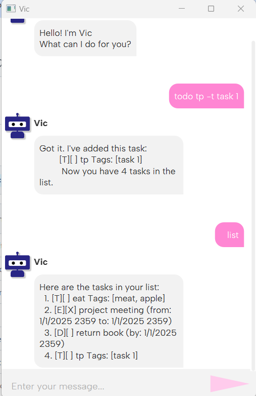

# Chatbot Vic User Guide

**Chatbot Vic** is a cute and friendly assistant designed to help you manage tasks through an intuitive graphical interface (GUI) built using FXML.

## GUI Overview
The GUI allows you to interact with Vic, where you can easily manage your tasks, mark them as done, and more.

## Features

### 1. **Add a Task**
You can add various types of tasks by specifying their name, deadline, event times, and tags.

- **To-Do Task**:  
  Command: `todo taskname -t a, b, c`  
  Example: `todo eat -t apple, banana, grapes`

- **Deadline Task**:  
  Command: `deadline taskname /by 2/12/2019 1800`  
  Example: `deadline return book /by 2/12/2019 1800`

- **Event Task**:  
  Command: `event taskname /from 12/10/2023 1800 /to 12/10/2023 1900 -t a, b, c`  
  Example: `event project meeting /from 1/1/2025 0900 /to 1/1/2025 1100 -t work, important`

#### Constraints:
- The order of the elements is important:
  - `/t` must be at the end (optional).
  - `/from` must be before `/to`.

### 2. **List Tasks**
To view all tasks, use the command:

### 3. **Delete a Task**
To delete a task by its number, use the command:
Example: `delete 1`

### 4. **Mark a Task**
To mark a task as completed, use the command:
Example: `mark 1`

### 5. **Unmark a Task**
To unmark a task (set it back to pending), use the command:
Example: `unmark 1`

### 6. **Find a Task**
To search for a task by name, use the command:
Example: `find return book`

### 7. **Tag a Task**
To tag a task by its number, use the command:
Example: `tag 1 urgent`

### 8. **Untag a Task**
To remove a tag from a task by its number, use the command:
Example: `untag 1 urgent`

## Storage Functionality

Vic stores all tasks in a text file located at:

### Format:
The tasks are stored in the following format:

- **T** for To-Do Task:  
  `T | status | task name | tags`

- **E** for Event Task:  
  `E | status | task name | from date/time | to date/time | tags`

- **D** for Deadline Task:  
  `D | status | task name | due date/time | tags`

### Example:

- **T | 0**: A To-Do task (not marked as done).
- **E | 1**: An Event task (marked as done).
- **D | 0**: A Deadline task (not marked as done).

---

Enjoy using Chatbot Vic to manage your tasks with ease!
